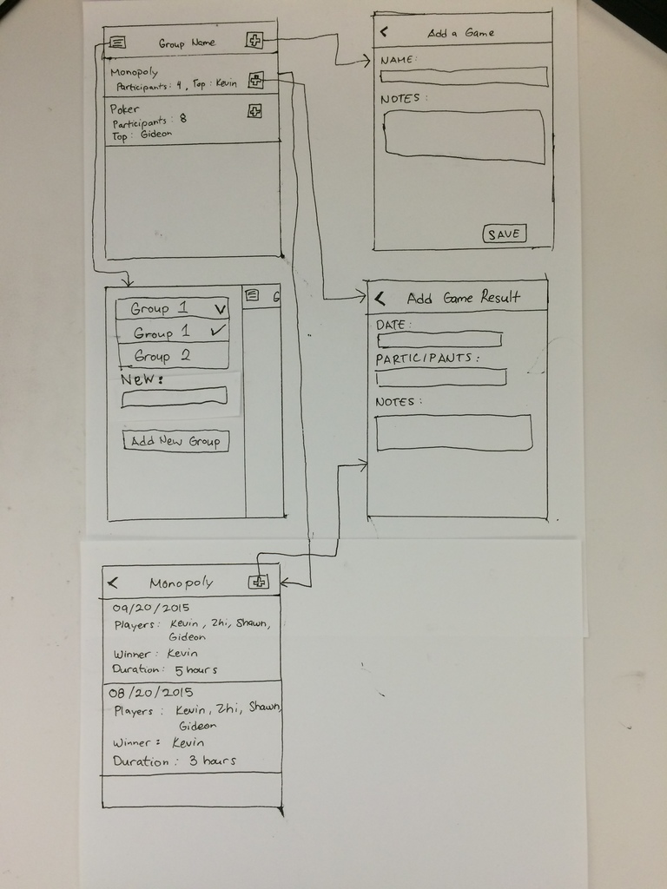

# Game Nights

This is an iOS app to keep records of match results. You can create a group for you and your friends. Groups have a list of games, and games have a list of results.

## User stories
- You and your group of friends play games regularly. You couldn't remember the last time one of your friends have won game. With this app you could view match history and find out when the last time that friend has won the game.
- You and your group of friends play games regularly. You realize one of your friends wins a lot of games. With this app you could view match history and find out what days this friend usually plays, so you could avoid playing with that person.
- Your group of friends play games regularly. You were recently invited to play with them for the first time. You find out they were using this app. You use the app to see what games your friends have played and suggest games you know how to play or want to play.

## Wireframe

